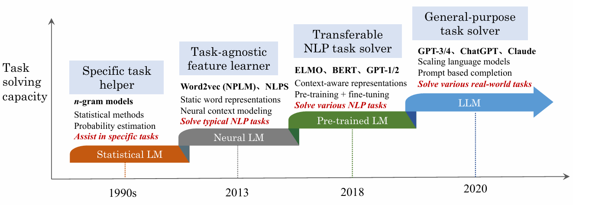

# 斯坦福CS224N自然语言处理笔记

##  项目简介

本项目包含斯坦福CS224N自然语言处理课程的学习笔记，涵盖了从传统统计语言模型到现代大型语言模型的完整发展历程。笔记以Jupyter Notebook形式呈现，结合理论讲解与代码实现。

##  基于《A Survey of Large Language Models》的语言模型发展历程

语言模型的发展经历了四个重要阶段，每个阶段都代表了自然语言处理技术的重大突破：

---

##  语言模型发展的四个阶段


### 1️ **SLM (Statistical Language Models) - 统计语言模型时代**

**核心技术：** N-gram统计模型

**主要特点：**
- 基于词汇共现统计的概率模型
- 使用马尔可夫假设，假设当前词只依赖于前n-1个词
- 简单高效，但存在数据稀疏性问题

**相关论文链接：**
- [Statistical Methods for Speech Recognition](https://aclanthology.org/J99-2009.pdf) 系统阐述了统计方法（尤其是隐马尔可夫模型HMM）在语音识别中的核心应用
- [Efficient Estimation of Word Representations in Vector Space](https://arxiv.org/pdf/1301.3781)出了两种新颖的模型架构，用于从超大规模数据集中计算单词的连续向量表示。
---

### 2️ **NLM (Neural Language Models) - 神经语言模型时代**

**核心技术：** Word2Vec、RNN系列模型

**主要突破：**
- 引入分布式词表示（Word Embeddings）
- 使用神经网络学习词汇的语义表示
- 能够捕捉词汇间的语义相似性

**Word2Vec RNN系列**

**相关论文链接：**
- [A Neural Probabilistic Language Model ](https://proceedings.neurips.cc/paper_files/paper/2000/file/728f206c2a01bf572b5940d7d9a8fa4c-Paper.pdf)提出了一种​​神经概率语言模型​​，通过分布式词向量表示和神经网络联合建模，显著提升了传统n-gram语言模型的性能

---

### 3️ **PLM (Pre-trained Language Models) - 预训练语言模型时代**

**核心技术：** BERT、GPT-2、Transformer架构

**关键模型：**

**BERT (Bidirectional Encoder Representations from Transformers)：**


**GPT-2 (Generative Pre-trained Transformer 2)：**

**相关论文链接：**
- [Scaling Laws for Neural Language Models](https://arxiv.org/pdf/2303.18223v16) 

---

### 4️ **LLM (Large Language Models) - 大型语言模型时代**

**核心技术：** GPT-3、ChatGPT、GPT-4

- 模型规模的指数级增长（千亿到万亿参数）
- 涌现能力（Emergent Abilities）的出现
- 少样本学习和零样本学习能力

**关键模型：**

**GPT-3 ChatGPT GPT-4**

**相关论文链接：**
<!-- 在此处插入GPT-3、ChatGPT、GPT-4相关论文链接 -->

---

## 📈 Scaling Laws - 大型语言模型的规模效应

### 🔍 规模效应概述

规模效应是理解大型语言模型性能与关键因素关系的重要理论基础。随着模型规模、数据规模和计算资源的大幅增长，研究人员发现了模型性能遵循特定数学规律的现象。

**核心发现：**
- 模型性能与模型大小、数据大小、计算量之间存在幂律关系
- 适当的资源分配策略可以最大化模型性能
- 为大模型的设计和训练提供了理论指导

---

### 📊 两大经典规模效应

#### 1️⃣ **KM Scaling Law (Kaplan-McCandlish Scaling Law)**

**提出者：** Kaplan等人 (OpenAI, 2020)

**核心思想：** 首次系统性地建立了模型性能与三大关键因素的幂律关系

**数学表达：**

给定计算预算C，三个基本缩放公式为：

```
L(N) = Nc / N^αN,  αN ≈ 0.076, Nc ≈ 8.8×10^13
L(D) = Dc / D^αD,  αD ≈ 0.095, Dc ≈ 5.4×10^13  
L(C) = Cc / C^αC,  αC ≈ 0.050, Cc ≈ 3.1×10^8
```

**参数说明：**
- L(·)：交叉熵损失（以nats为单位）
- N：模型大小（非嵌入参数数量）
- D：数据集大小（训练token数量）
- C：计算量（FP-days）

**关键发现：**
- 模型性能对三个因素都有强依赖关系
- 在计算预算分配上，更倾向于增加模型大小而非数据大小

#### 2️⃣ **Chinchilla Scaling Law**

**提出者：** Hoffmann等人 (Google DeepMind)

**核心改进：** 提出了计算最优的训练策略，重新审视了模型大小与数据大小的平衡

**数学表达：**

```
L(N,D) = E + A/N^α + B/D^β
```

**参数值：**
- E = 1.69 (不可约损失)
- A = 406.4, B = 410.7
- α = 0.34, β = 0.28

**最优分配策略：**

在约束条件 C ≈ 6ND 下，最优的模型大小和数据大小为：

```
Nopt(C) = G × (C/6)^a
Dopt(C) = G^(-1) × (C/6)^b
```

其中：
- a = α/(α+β) ≈ 0.55
- b = β/(α+β) ≈ 0.45
- G 是由A、B、α、β计算得出的缩放系数

**重要结论：**
- **等比例缩放原则**：模型大小和数据大小应该近似等比例增长
- **计算最优性**：给定计算预算，存在最优的模型-数据配置

---
**相关论文链接：**
- [Scaling Laws for Neural Language Models](https://arxiv.org/abs/2001.08361) - KM缩放定律原始论文
- [Training Compute-Optimal Large Language Models](https://arxiv.org/abs/2203.15556) - Chinchilla缩放定律论文
- [Scaling Laws for Autoregressive Generative Modeling](https://arxiv.org/abs/2010.14701) - 生成模型缩放定律扩展研究

---

## 🔄 Disscusion of Scaling Law


- **可预测性（Predictable Scaling）**：Scaling Law 可用于预测大模型性能、发现训练异常与调优策略。即便收益递减，语义质量仍可能提升；但数据稀缺问题可能限制扩展效果。

- **任务层面可预测性（Task-level Predictability）**：语言建模损失的下降不总能带来任务表现提升，甚至可能出现“反向扩展”现象。一些能力（如In-context learning）只有在模型达到特定规模后才会突现，难以通过Scaling Law预测。

---

## Emergent Abilities（突现能力）
  突现能力指的是那些在小模型中缺失、但在模型规模达到一定阈值后突然出现的高级能力，表现出类似物理相变的“非线性跃迁”特征。

- **典型突现能力**：
1. **In-context Learning（上下文学习）**：
    模型仅通过输入自然语言示例即可学习任务，无需参数更新。首次在GPT-3中显现，效果随规模而增强。

2. **Instruction Following（指令跟随）**：
    通过instruction tuning使模型能够理解并执行自然语言任务描述。至少需62B模型（如PaLM）才能稳定展现此能力。

3. **Step-by-step Reasoning（逐步推理）**：
    借助Chain-of-Thought提示，模型可以分步骤完成复杂推理任务。该能力可能与代码训练有关，在大于60B模型中效果显著。

---

**相关论文链接：**
- [Chain-of-Thought Prompting Elicits Reasoning in Large Language Models](https://arxiv.org/abs/2201.11903) - 引入Chain-of-Thought提示的论文
- [Large Language Models are Few-Shot Learners](https://arxiv.org/abs/2005.14165) - GPT-3的原始论文


## 📁 项目结构

```
斯坦福cs224n 笔记/
├── README.md                          # 项目说明文档
├── A Survey of Large Language Models.pdf  # 参考论文
├── PretrainedModels.ipynb             # 预训练模型笔记
├── NLG.ipynb                          # 自然语言生成笔记
├── InContextLearning.ipynb            # 上下文学习笔记
├── EvaluationMethods.ipynb            # 评估方法笔记
├── word2ector.ipynb                   # Word2Vec笔记
├── RNN.ipynb                          # RNN模型笔记
├── Lstm.ipynb                         # LSTM模型笔记
├── Attention.ipynb                    # 注意力机制笔记
├── SelfAttention.ipynb                # 自注意力机制笔记
├── Bleu.ipynb                         # BLEU评估指标笔记
└── img/                               # 图片资源文件夹
    ├── lstm.png
    ├── rnn.png
    └── word2vector.png
```

## 🔗 相关资源

- [斯坦福CS224N课程官网](http://web.stanford.edu/class/cs224n/)
- [Hugging Face Transformers库](https://huggingface.co/transformers/)
- [OpenAI GPT系列论文](https://openai.com/research/)

## 🤝 贡献

欢迎提交Issue和Pull Request来完善这些学习笔记！

---

*最后更新：2025年*